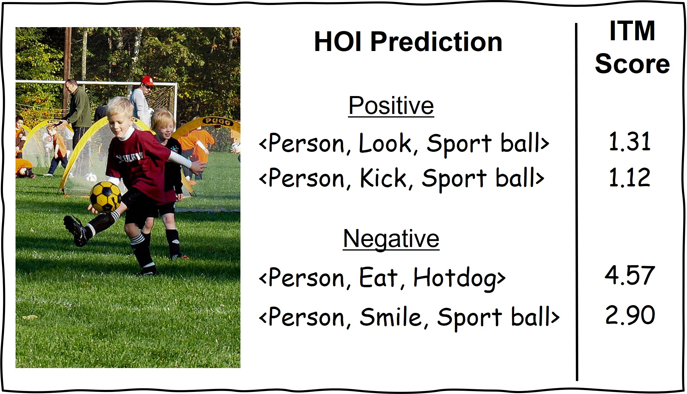
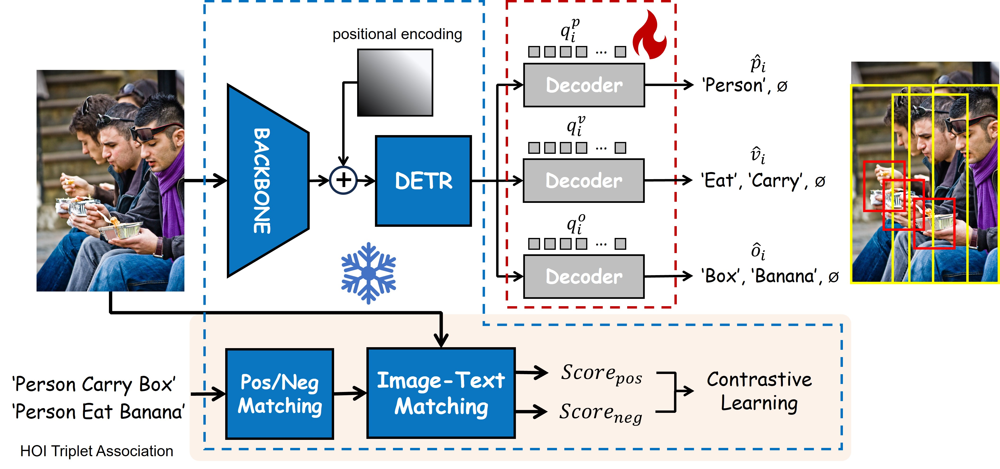

# VLM-HOI

## Introduction
This repository contains the code for the paper VLM-HOI: Contrastive Knowledge Distillation from the Large Vision Language Model for Human-Object Interaction Detection. The code is based on [CDN](https://github.com/YueLiao/CDN) and [MUREN](https://github.com/OreoChocolate/MUREN).




## Installation
1. Clone this repository.
2. Create conda environment using the following command:
```
conda create -n vlm_hoi python=3.9
conda activate vlm_hoi
```
3. Install the dependencies using the following command:
```
pip install -r requirements.txt
```
## Data preparation
3. Download the [data](https://drive.google.com/drive/folders/1cOge9zF-E1j0ZrEPWyMRxdTvTghyhP9F)
4. Download the [pretrained model](https://drive.google.com/drive/folders/1-JmwpwDWtHyyPhC0BCLRhJ9eIj5FLdYf?usp=sharing)
5. Extract the data and pretrained model to:
```
VLM-HOI
├── data
│   ├── hico_20160224_det
│   └── v-coco
└── pretrained
```

## Training

### V-COCO
To train the model, run the following command:
```
torchrun --nproc_per_node=4 main.py \ 
        --pretrained pretrained/detr-r50-pre-2stage-nq100.pth \
        --output_dir  PATH/TO/SAVE \
        --dataset_file vcoco --hoi_path data/v-coco \
        --num_obj_classes 81 --num_verb_classes 29 \
        --backbone resnet50 --num_queries 100 \
        --enc_layers 6 --dec_layers 6 \
        --epochs 100 --lr_drop 60 --num_worker 8 --batch_size 4 --freeze
```
It takes about 2 days to train the model on 4 3090 GPUs.

### HICO-DET
To train the model, run the following command:
```
torchrun --nproc_per_node=4 main.py \
        --pretrained pretrained/detr-r50-pre-2stage-nq64.pth \
        --output_dir PATH/TO/SAVE \
        --dataset_file hico --hoi_path data/hico_20160224_det \
        --num_obj_classes 80 --num_verb_classes 117 \
        --backbone resnet50 --num_queries 64 \
        --enc_layers 6 --dec_layers 6 \
        --epochs 100 --lr_drop 60 --num_worker 8 --batch_size 4
```
It takes about 5 days to train the model on 4 3090 GPUs.

## Evaluation

### V-COCO

To evaluate the model, run the following command:
```
python generate_vcoco_official.py \
        --param_path "pretrained/vcoco-best.pth" \
        --save_path "data/v-coco/vcoco.pickle" \
        --hoi_path data/v-coco \
        --num_queries 100 --dec_layers 6 --batch_size 1 --backbone resnet50 --use_nms_filter

cd data/v-coco
python vsrl_eval.py "vcoco.pickle"
```

### HICO-DET
To evaluate the model, run the following command:
```
python main.py --pretrained "pretrained/hico-best.pth" \
  --dataset_file hico --hoi_path data/hico_20160224_det \
  --num_obj_classes 80 --num_verb_classes 117 --backbone resnet50 \
  --num_queries 64 --dec_layers 6 --num_workers 8 --batch_size 4 --use_nms_filter \
  --eval
```

